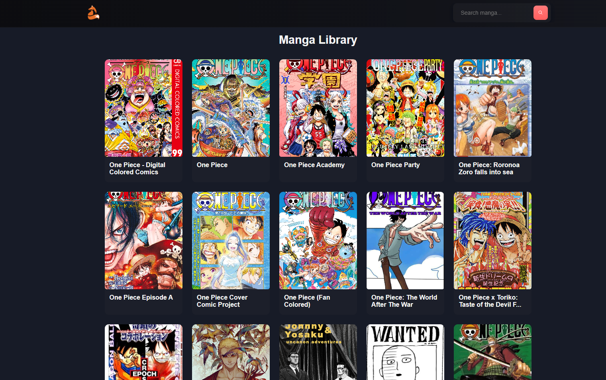
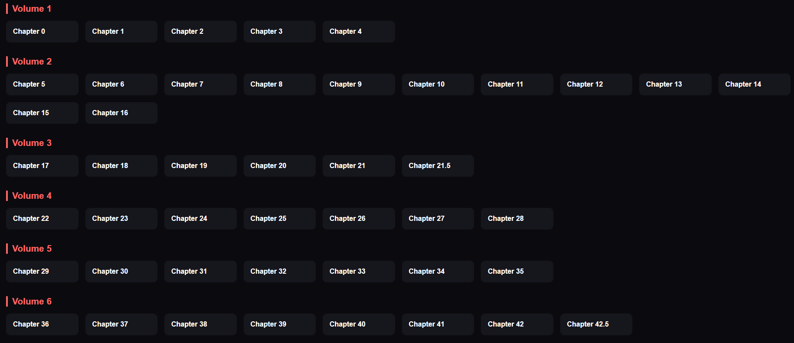
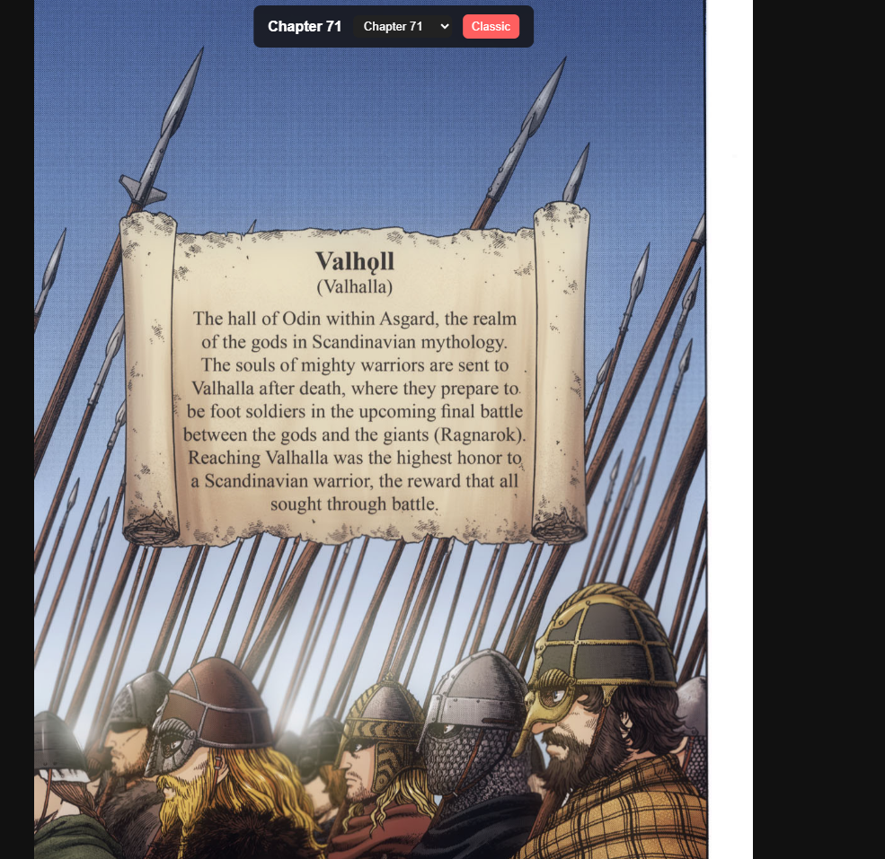

# React Manga Reader with Mangadex API

I've mande a manga reader using the [Mangadex API](https://api.mangadex.org/docs/) with React. I had some issues with CORS and to solve it I used [CorsProxy.io](https://corsproxy.io/) to proxy the requests and receive the response data correctly. Also, I had some problems in rendering the images in the Github Pages; It was working fine on localhost, but after deploying on Github Pages it was only rendering an "you can read this at mangadex" error image instead of the correct cover or pages images from each manga. I wrote a Medium post [here](https://medium.com/@nekitiubitiubiriba/manga-reader-with-mangadex-f99837896ca0). In the issues section I talked about that problem. But I found a solution using a chrome extension called [ModHeader Extension](https://chromewebstore.google.com/detail/modheader-modify-http-hea/idgpnmonknjnojddfkpgkljpfnnfcklj?hl=). After that, I posted again on Medium talking about it. You can read it [here](https://medium.com/@nekitiubitiubiriba/manga-reader-with-mangadex-2-0-0d481473a5c7).

The app is simple: There's a search bar where you write something and then you click enter to search for a manga with that name. Then, it will render a manga list on the page, showing the cover, name and author from each manga.

There's a useState variable called "query". That "query" is what you search in the input bar, and it will be used in the URL to search for mangas with that name. To update the query I'm using the onChange function to set the query (setQuery useState function) to the value writen in the input. And this input is wraped inside a form tag where there's an onSubmit function, which makes that when you hit enter it will use that query to fetch data from the API. That manga list is also an useState function. You can see it at the [Home.jsx](https://github.com/lucasgabriellanarosa/MangaPneu/blob/main/src/pages/Home/Home.jsx). Then, clicking on a manga title it will load a page with the details from it.

There's the cover image, the title, tags and a description from the manga. After that, there's a select bar where you choose the language the chapters will be, and also chapters lists nested inside volumes lists. It uses to fetch functions. One of them will fetch the data from the image, tags and description and set it to the useState variable mangaData. The other one will fetch the volumes and chapter list based on the selected language, there's also an useState variable assimilate to it: volumeChaptersData. You can check it here [MangaPage.jsx](https://github.com/prazdn1ck/MangaPneu/blob/main/src/pages/MangaPage/MangaPage.jsx). Then you click on the chapter you want to read and it will load the last page I made, where you can read it.

